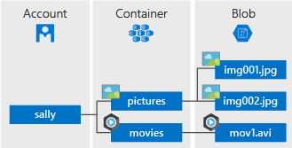

# AzureWasbPlay

Windows Azure Storage Blob (WASB) is an extension built on top of the HDFS APIs. The WASBS variation uses SSL certificates for improved security. It in many ways "is" HDFS. However, WASB creates a layer of abstraction that enables separation of storage. This separation is what enables your data to persist even when no clusters currently exist and enables multiple clusters plus other applications to access a single piece of data all at the same time. This increases functionality and flexibility while reducing costs and reducing the time from question to insight.

Requirements  
You can read data from public storage accounts without any additional settings. To read data from a private storage account, you must configure a Shared Key or a Shared Access Signature (SAS).

<https://azure.microsoft.com/en-us/services/storage/blobs/>

+ introduction - <https://docs.microsoft.com/en-us/azure/storage/blobs/storage-blobs-introduction>

## [Blob Type](https://docs.microsoft.com/en-us/azure/storage/blobs/storage-blobs-introduction#blobs)

Azure Storage supports three types of blobs:

+ Block blobs store text and binary data, up to about 4.7 TB. Block blobs are made up of blocks of data that can be managed individually.
+ Append blobs are made up of blocks like block blobs, but are optimized for append operations. Append blobs are ideal for scenarios such as logging data from virtual machines.
+ Page blobs store random access files up to 8 TB in size. Page blobs store virtual hard drive (VHD) files and serve as disks for Azure virtual machines. For more information about page blobs, see [Overview of Azure page blobs](https://docs.microsoft.com/en-us/azure/storage/blobs/storage-blob-pageblob-overview)

## [Object model](https://docs.microsoft.com/en-us/azure/storage/blobs/storage-quickstart-blobs-java#object-model)

Azure Blob storage is optimized for storing massive amounts of unstructured data. Unstructured data is data that does not adhere to a particular data model or definition, such as text or binary data. Blob storage offers three types of resources:

+ The storage account
+ A container in the storage account
+ A blob in the container

The following diagram shows the relationship between these resources.

## [Scale targets for Blob storage](https://docs.microsoft.com/en-us/azure/storage/blobs/scalability-targets#scale-targets-for-blob-storage)

| Resource | Target |
| ---- | ----------- |
|Maximum size of single blob container                       | Same as maximum storage account capacity     |
|Maximum number of blocks in a block blob or append blob     | 50,000 blocks                                |
|Maximum size of a block in a block blob                     | 100 MiB                                      |
|Maximum size of a block blob                                | 50,000 X 100 MiB (approximately 4.75 TiB)    |
|Maximum size of a block in an append blob                   | 4 MiB                                        |
|Maximum size of an append blob                              | 50,000 x 4 MiB (approximately 195 GiB)       |
|Maximum size of a page blob                                 | 8 TiB                                        |
|Maximum number of stored access policies per blob container | 5                                            |
|Target request rate for a single blob                       | Up to 500 requests per second                |
|Target throughput for a single page blob                    | Up to 60 MiB per second                      |
|Target throughput for a single block blob                   | Up to storage account ingress/egress limits1 |

## Java SDK

+ Java SDK quick start - <https://docs.microsoft.com/en-us/azure/storage/blobs/storage-quickstart-blobs-java>
+ Java SDK Sample - <https://github.com/Azure/azure-sdk-for-java/tree/master/sdk/storage/azure-storage-blob/src/samples/java/com/azure/storage/blob>

Use the following Java classes to interact with these resources:

+ [BlobServiceClient](https://azuresdkdocs.blob.core.windows.net/$web/java/azure-storage-blob/12.0.0/com/azure/storage/blob/BlobServiceClient.html): The BlobServiceClient class allows you to manipulate Azure Storage resources and blob containers. The storage account provides the top-level namespace for the Blob service.
+ [BlobServiceClientBuilder](https://azuresdkdocs.blob.core.windows.net/$web/java/azure-storage-blob/12.0.0/com/azure/storage/blob/BlobServiceClientBuilder.html): The BlobServiceClientBuilder class provides a fluent builder API to help aid the configuration and instantiation of BlobServiceClient objects.
+ [BlobContainerClient](https://azuresdkdocs.blob.core.windows.net/$web/java/azure-storage-blob/12.0.0/com/azure/storage/blob/BlobContainerClient.html): The BlobContainerClient class allows you to manipulate Azure Storage containers and their blobs.
+ [BlobClient](https://azuresdkdocs.blob.core.windows.net/$web/java/azure-storage-blob/12.0.0/com/azure/storage/blob/BlobClient.html): The BlobClient class allows you to manipulate Azure Storage blobs.
+ [BlobItem](https://azuresdkdocs.blob.core.windows.net/$web/java/azure-storage-blob/12.0.0/com/azure/storage/blob/models/BlobItem.html): The BlobItem class represents individual blobs returned from a call to listBlobsFlat.

## Python SDK

+ Python SDK quick start - <https://docs.microsoft.com/en-us/azure/storage/blobs/storage-quickstart-blobs-python>

## WASB with Hadoop

+ WASB and Hadoop Storage - <https://docs.microsoft.com/en-us/archive/blogs/cindygross/understanding-wasb-and-hadoop-storage-in-azure>
+ Hadoop Azure Support - <https://hadoop.apache.org/docs/current/hadoop-azure/index.html>
